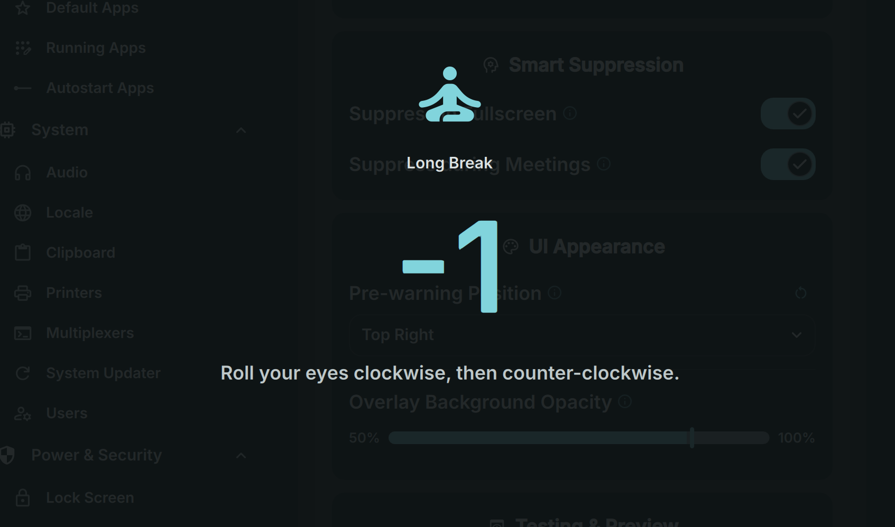

# Take a Break

A gentle companion that reminds you to rest your eyes with short and long breaks.



## Install

Use the DMS CLI:
```bash
dms plugins install takeABreak
```

Or manually:
```bash
git clone https://github.com/hthienloc/dms-take-a-break ~/.config/DankMaterialShell/plugins/takeABreak
```

## Features

- **Break Cycles** - Automated reminders for short eye-rests and configurable long physical breaks after a set number of short breaks.
- **Pre-warning Toast** - Subtle notification 10 seconds before a break to Snooze or Skip.
- **Fullscreen Overlay** - Immersive break experience with health tips and a countdown timer.
- **Smart Suppression** - Automatically delays breaks if you are in a fullscreen app or game.
- **UI Customization** - Choose from 8 screen positions for warnings and adjust overlay transparency.
- **Work Area Aware** - UI elements automatically avoid DMS bars and docks.

## Usage

### Bar Icon / Popout

| Action | Result |
|--------|--------|
| Left click | Open popout to see countdown and control timer |
| Pause/Resume | Temporarily stop the break cycle |
| Reset | Restart the session timer |

### Pre-warning Toast

| Action | Result |
|--------|--------|
| Snooze (5m) | Delay the break for 5 minutes |
| Skip | Skip the current break and start the next interval |

### Fullscreen Overlay

- Displays a random eye-health tip.
- Countdown timer shows break progress.
- "Skip this break" button available if you need to return to work immediately.

## IPC Commands

Use `dms ipc call takeABreak <command>` to control the plugin from scripts or keybindings.

| Command | Description |
|---------|-------------|
| `preview prewarning` | Show a preview of the pre-warning toast |
| `preview overlay` | Show a preview of the fullscreen break overlay |

## License

GPL-3.0

## Roadmap / TODO
- [ ] **Meeting Detection:** Automatically detect active microphone usage to snooze breaks during calls.
- [ ] **Sound Alerts:** Optional gentle chimes to signal the start and end of a break.
- [ ] **Custom Tips:** Allow users to add their own text or images to the break overlay.
- [ ] **Statistics:** Track and display your daily break completion rate.
